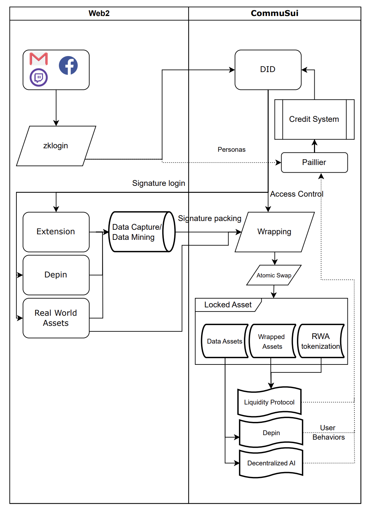

# CommuSui
CommuSui is a data trading tool in the field of distributed artificial intelligence.CommuSui facilitates users to annotate and upload data using an easy data annotation plugin, and can share out data in a multi-component atomic exchange.CommuSui uses attribute-based encryption (abe) technology to locally encrypt and lock users' data to accomplish multiple sales or rentals. This mechanism can be used not only to sell user data, but also to manage project airdrops, RWA assets, or SFT asset sales, using attribute-based encryption to stipulate that only participants who contribute to the project will be granted access or rewards.

## archflow

## deck
https://docs.google.com/presentation/d/1K1iKtlsQMwzjIDjBVLPjKaGi8nH86MI8ebFObkhJ25o/edit?usp=sharing

